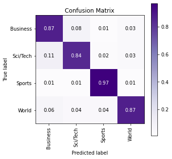

# Forward-forward-NLP

## Background

**Data Set**: AG News

- Training: 120,000 news articles
- Testing: 7,600 news articles

**Task**: Text Classification

- 4 classes (“World”, “Sports”, “Business”, “Sci/Tech”)

**Embedding**: GloVe(name='840B', dim=300)

## Experiments

**Common Treatment:**

- take *average* of each word embeddings in the article
- put embeddings into 4 layer neural networks
- train-valid ratio: 95:5 

### Back Propagation Results

**Test Accuracy** : 0.9180

**Classification Report** :               

|					|precision |   recall|  f1-score |  support|        
| ---  | ---  | ---  | ---  | ---  |
|World   |    0.93    |  0.91   |   0.92    |  1900      |
|Sports   |    0.98   |   0.97     | 0.97  |    1900    |
|Business   |    0.86  |    0.90    |  0.88  |    1900    |
|Sci/Tech    |   0.91   |   0.89  |    0.90  |    1900     |
|accuracy| | |                         0.92    |  7600  | 
|macro avg    |   0.92    |  0.92    |  0.92   |   7600 |
|weighted avg  |     0.92  |    0.92   |   0.92   |   7600  |

**Confusion Matrix** :  

[[1736   29   92   43] 

[  31 1837   24    8]

 [  54    8 1717  121]

 [  46   10  157 1687]]

### Forward-forward Results

- Positive Samples: subsitute first 4 entries with dummy labels in each 300-d embeddings

- Negative Samples: subsitute first 4 entries with random *wrong* dummy labels in each 300-d embeddings

- each layer: epoch = 1000

**Test Accuracy** : 0.8871

**Classification Report** :               

||dprecision   | recall  |f1-score |  support      |  
|---|---|---|---|---|
|World    |   0.92   |   0.87    |  0.89    | 28437 |     
|Sports     |  0.94    |  0.97    |  0.95  |   28562    |
|Business  |     0.83   |   0.87   |   0.85    | 28499    |
|Sci/Tech     |  0.87    |  0.84   |   0.85   |  28502   |  
|accuracy        |             |      |0.89  |  114000   |
|macro avg     |  0.89  |    0.89    |  0.89  |  114000 |
|weighted avg   |    0.89    |  0.89   |   0.89  |  114000  |

**Confusion Matrix** :  

[[24615  1029  1779  1014]

 [  365 27776   231   190]

 [  839   395 24904  2361] 

[  946   465  3251 23840]]

